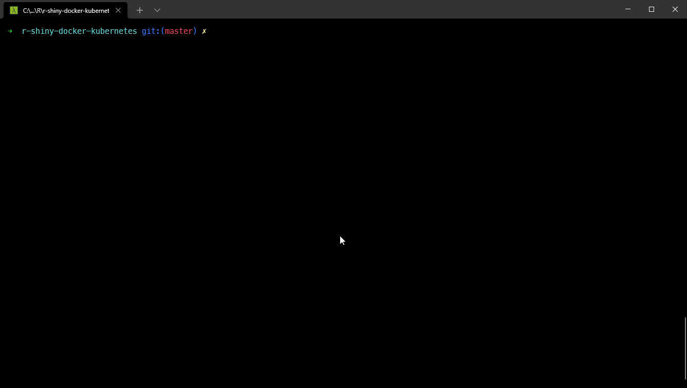

# :rocket: Containerize R Shiny apps with Docker :whale: and deploy to Kubernetes :wheel_of_dharma: Cluster

This project repository will help you to set up your R Shiny apps and:

- [x] Containerize using Docker :whale:
- [x] Deploy to Kubernetes :wheel_of_dharma: cluster using manifests
- [x] Deploy to Kubernetes :wheel_of_dharma: cluster using Helm charts
- [ ] To-do: Use ShinyProxy for authentication and deploy ShinyProxy to Kubernetes :wheel_of_dharma: cluster
- [ ] To-do: Use Nginx HTTP authentication and deploy to Kubernetes :wheel_of_dharma: cluster

I used Windows 10 as my local machine with `minikube` setup (Kubernetes) for this project. However, all the tools that I've listed are available on macOS and Linux distros.

Repository branches:

> `master` branch  :arrow_right: Docker files
>
> `kubernetes` :arrow_right: Docker files :heavy_plus_sign: Kubernetes deployment with manifests
>
> `helm` :arrow_right: Docker files :heavy_plus_sign: Kubernetes deployment with Helm chart

Notes:
> *`"master"`* branch has files for dockerizing shiny app with shiny server
>
> *`"kubernetes"`* branch has files for dockerizing shiny app and deploying to Kubernetes cluster using manifests
>
> *`"helm"`* branch has files for dockerizing shiny app and deploying to Kubernetes cluster with Helm charts

## 1. :package: Software requirements

Please make sure that you have the following software setup on your computer.

1. :sparkles: Git - [https://git-scm.com/downloads](https://git-scm.com/downloads)

2. :rocket: WSL 2 (mandatory for Windows) installation steps / or feel free to use other virtualization technologies
    - [https://docs.microsoft.com/en-us/windows/wsl/install-win10](https://docs.microsoft.com/en-us/windows/wsl/install-win10)
    - [https://www.omgubuntu.co.uk/how-to-install-wsl2-on-windows-10](https://www.omgubuntu.co.uk/how-to-install-wsl2-on-windows-10)

3. :whale: Docker - [https://hub.docker.com/editions/community/docker-ce-desktop-windows/](https://hub.docker.com/editions/community/docker-ce-desktop-windows/)

4. :computer: Other docker UI tools (not mandatory) - docker desktop UI is good enough to view all your containers and images, I personally like Portainer and Dockstation because of their custom features that are not there in the default docker desktop GUI application.
    - Portainer - [https://documentation.portainer.io/v2.0/deploy/ceinstalldocker/](https://documentation.portainer.io/v2.0/deploy/ceinstalldocker/)
    - Dockstation - [https://dockstation.io/](https://dockstation.io/)

## 2. :card_index_dividers: Project setup and details

Clone the repository from - [https://github.com/py404/r-shiny-docker-kubernetes](https://github.com/py404/r-shiny-docker-kubernetes) locally before going to next sections.

For docker deployment, stay in the master branch and proceed to next steps.

### 2.1 Project structure

Project files and folders required are:

```{master branch}
📦r-shiny-docker-kubernetes
 ┣ 📂app
 ┃ ┗ 📜app.R
 ┣ 📂Docker
 ┃ ┣ 📂nginx
 ┃ ┃ ┣ 📜nginx.conf
 ┃ ┃ ┗ 📜nginx.Dockerfile
 ┃ ┣ 📂shiny
 ┃ ┃ ┣ 📜index.html
 ┃ ┃ ┗ 📜shiny.Dockerfile
 ┃ ┣ 📜.dockerignore
 ┃ ┗ 📜docker-compose.yml
 ┣ 📜.gitignore
 ┗ 📜README.md
```

:card_index_dividers: app folder - contains `app.R` which has a simple `shiny dashboard` bins app.

To containerize your own shiny apps, copy your project files to `app` folder and proceed to next steps for docker deployment.

:card_index_dividers: Docker folder - contains docker files for shiny server and nginx.

## 3. :whale: Docker deployment

1. `cd` (change directory) to `Docker` folder
2. Run `docker compose` command

   ```{powershell}
   docker-compose up -d --build
   ```

   This command will create 2 containers:

   ```{text}
   (a) a Shiny server container
   (b) an nginx container
   ```

Nginx container acts as a proxy server for connecting to the shiny server.



Docker compose commands breakdown:

- The following only builds the images, does not start the containers:

    ```powershell
    docker-compose build
    ```

- The following builds the images if the images do not exist and starts the containers:

    ```powershell
    docker-compose up
    ```

- If you add the --build option, it is forced to build the images even when not needed:

    ```powershell
    docker-compose up --build
    ```

Navigate to [http://localhost:3838](http://localhost:3838) in your browser


