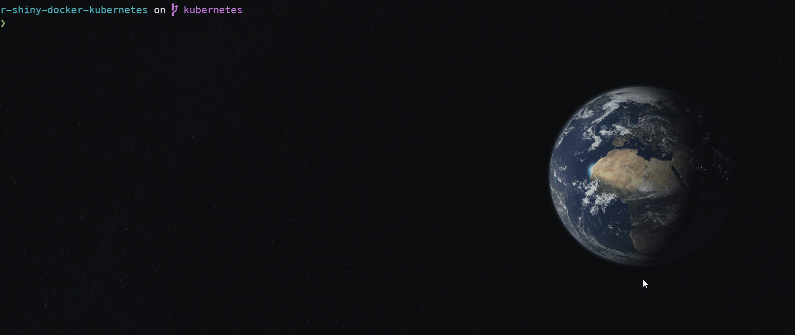
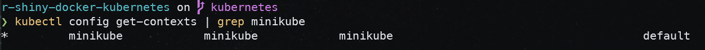
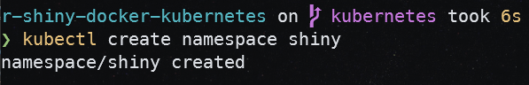
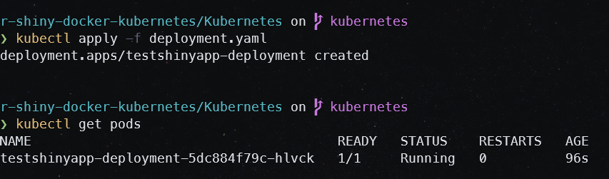
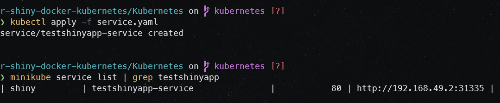
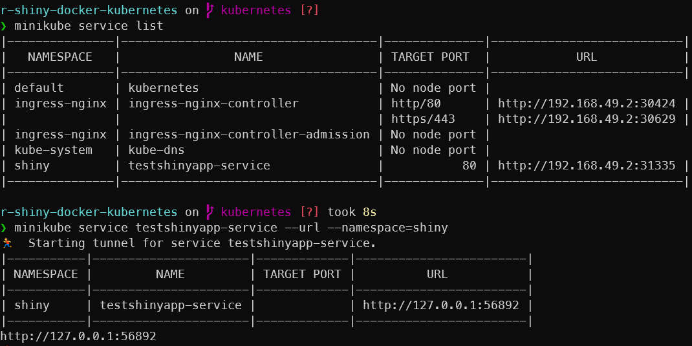
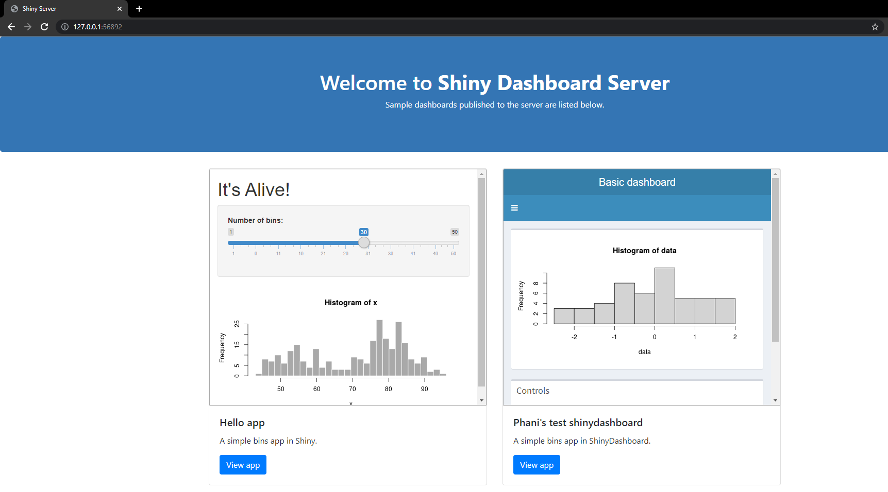

# :rocket: Containerize R Shiny apps with Docker :whale: and deploy to Kubernetes :wheel_of_dharma: Cluster

> NOTE: for `docker` build instructions, please refer `README` file in `master` branch
>
> Current branch: `kubernetes`

This project repository will help you to set up your R Shiny apps and:

- :white_check_mark: Containerize using Docker :whale:
- :white_check_mark: Deploy to Kubernetes :wheel_of_dharma: cluster using manifests
- :white_check_mark: Deploy to Kubernetes :wheel_of_dharma: cluster using Helm charts
- [ ] To-do: Use ShinyProxy for authentication and deploy ShinyProxy to Kubernetes :wheel_of_dharma: cluster
- [ ] To-do: Use Nginx HTTP authentication and deploy to Kubernetes :wheel_of_dharma: cluster

Repository branches:

> `master` branch  :arrow_right: Docker files
>
> `kubernetes` :arrow_right: Docker files :heavy_plus_sign: Kubernetes deployment with manifests
>
> `helm` :arrow_right: Docker files :heavy_plus_sign: Kubernetes deployment with Helm chart

Notes:
> *`"master"`* branch has files for dockerizing shiny app with shiny server
>
> *`"kubernetes"`* branch has files for dockerizing shiny app and deploying to Kubernetes cluster using manifests
>
> *`"helm"`* branch has files for dockerizing shiny app and deploying to Kubernetes cluster with Helm charts

## 1. :package: Software requirements

Please make sure that you have the following software setup on your computer.

1. :sparkles: Git - [https://git-scm.com/downloads](https://git-scm.com/downloads)

2. :rocket: WSL 2 (mandatory for Windows) installation steps / or feel free to use other virtualization technologies
    - [https://docs.microsoft.com/en-us/windows/wsl/install-win10](https://docs.microsoft.com/en-us/windows/wsl/install-win10)
    - [https://www.omgubuntu.co.uk/how-to-install-wsl2-on-windows-10](https://www.omgubuntu.co.uk/how-to-install-wsl2-on-windows-10)

3. :whale: Docker - [https://hub.docker.com/editions/community/docker-ce-desktop-windows/](https://hub.docker.com/editions/community/docker-ce-desktop-windows/)

4. :wheel_of_dharma: Minikube - [https://minikube.sigs.k8s.io/docs/start/](https://minikube.sigs.k8s.io/docs/start/)

5. :wheel_of_dharma: Kubectl - [https://kubernetes.io/docs/tasks/tools/#kubectl](https://kubernetes.io/docs/tasks/tools/#kubectl)

## 2. :card_index_dividers: Project setup and details

Clone the repository from - [https://github.com/py404/r-shiny-docker-kubernetes](https://github.com/py404/r-shiny-docker-kubernetes)

```{shell}
git clone https://github.com/py404/r-shiny-docker-kubernetes
```

Checkout to `Kubernetes` branch.

```{shell}
git checkout -b kubernetes
git pull origin kubernetes
```

### 2.1 Project structure

Project files and folders required are:

```{master branch}
📦r-shiny-docker-kubernetes
 ┣ 📂app
 ┃ ┗ 📜app.R
 ┣ 📂Docker
 ┃ ┣ 📂nginx
 ┃ ┃ ┣ 📜nginx.conf
 ┃ ┃ ┗ 📜nginx.Dockerfile
 ┃ ┣ 📂shiny
 ┃ ┃ ┣ 📜index.html
 ┃ ┃ ┗ 📜shiny.Dockerfile
 ┃ ┣ 📜.dockerignore
 ┃ ┗ 📜docker-compose.yml
 ┣ 📂Kubernetes
 ┃ ┣ 📜deployment.yaml
 ┃ ┗ 📜service.yaml
 ┣ 📜.gitignore
 ┗ 📜README.md
```

:card_index_dividers: Docker folder - contains docker files for shiny server and nginx.

:card_index_dividers: Kubernetes folder - contains manifest files for deploying Shiny app to Kubernetes cluster

## 3. :wheel_of_dharma: Kubernetes deployment with manifests

Please refer to documentation here - [https://kubernetes.io/docs/](https://kubernetes.io/docs/) if you are a beginner or novice in Kubernetes.

There are two manifests.

```{text}
deployment.yaml - for creating R Shiny pod
service.yaml - for connecting R Shiny pod with a service
```

Deployment - [https://kubernetes.io/docs/concepts/workloads/controllers/deployment/](https://kubernetes.io/docs/concepts/workloads/controllers/deployment/)

Service - [https://kubernetes.io/docs/concepts/services-networking/connect-applications-service/](https://kubernetes.io/docs/concepts/services-networking/connect-applications-service/)

> NOTE: before deployment, make sure `minikube` is running

1. To start `minikube`, run:

   ```{shell}
   minikube start
   ```

   

2. Use minikube context and create a new namespace:

   ```{shell}
   # get contexts 
   kubectl config get-contexts | minikube
   ```

   

   ```{shell}
   # create a namespace "shiny"
   kubectl create namespace shiny
   ```

   

3. Change current context to use `shiny` namespace

   ```{shell}
   kubectl config set-context --current --namespace=shiny
   kubectl config get-contexts | grep minikube
   ```

   

4. `cd` (change directory) to `Kubernetes` folder

   ```{shell}
   cd Kubernnetes
   ```

5. Apply manifests

   Deployment:

   ```{powershell}
   kubectl apply -f deployment.yaml
   ```

   

   Service:

   ```{powershell}
   kubectl apply -f service.yaml
   ```

   

6. Access `service`

   ```{shell}
   minikube service testshinyapp-service --url --namespace=shiny
   ```

   

   Open URL in your webbrowser: `http://127.0.0.1:56892` (port number will be different to this)

   
